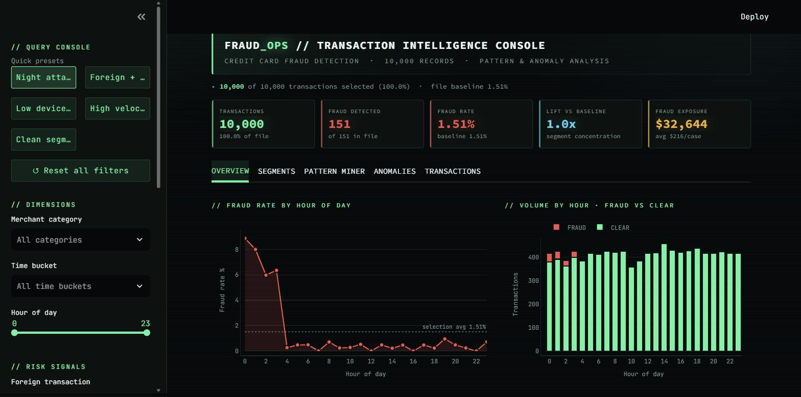
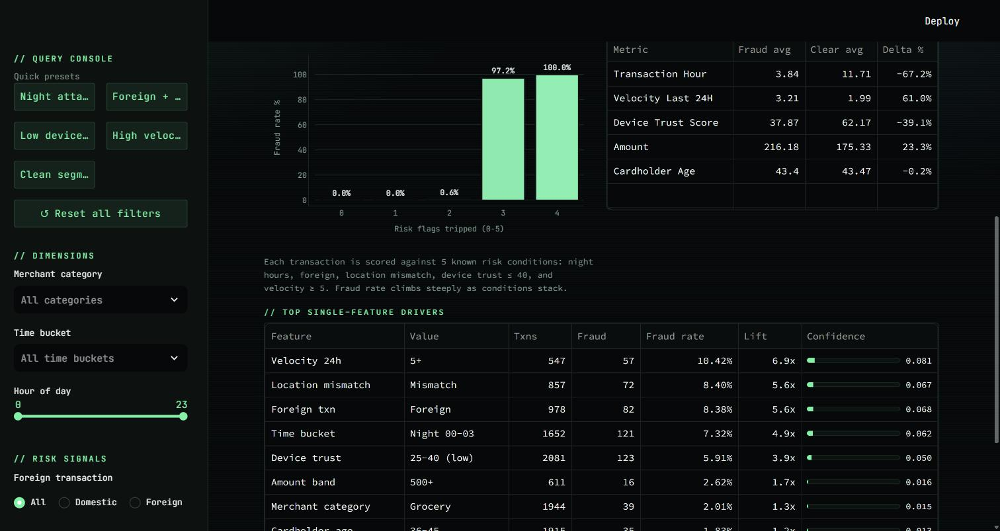
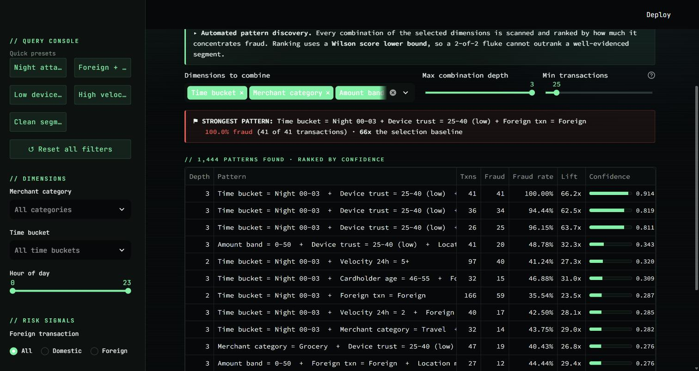
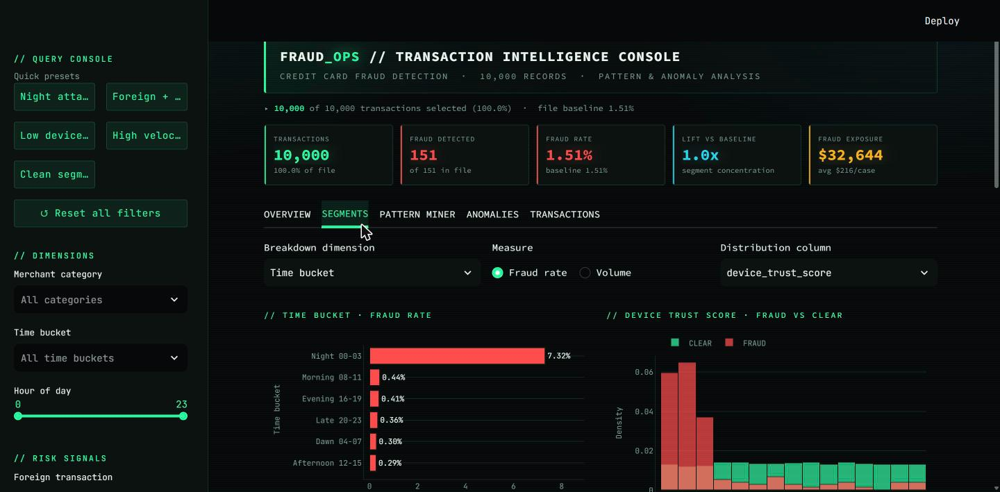
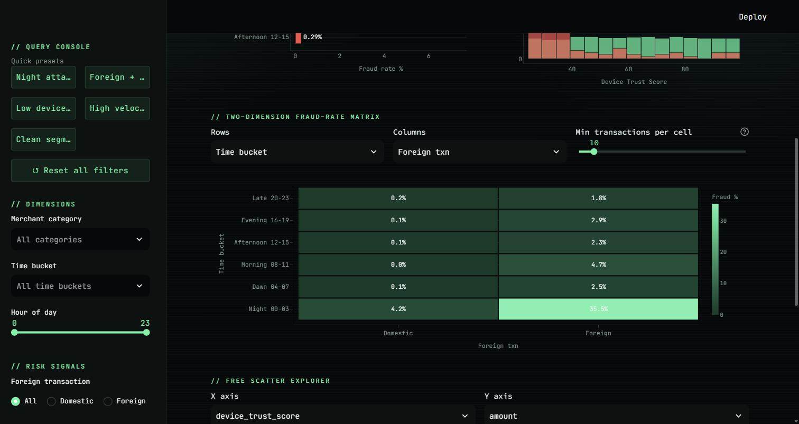
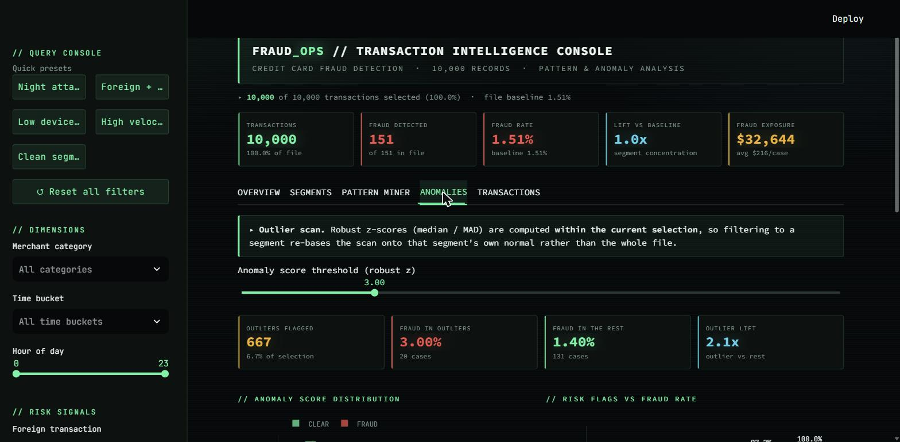
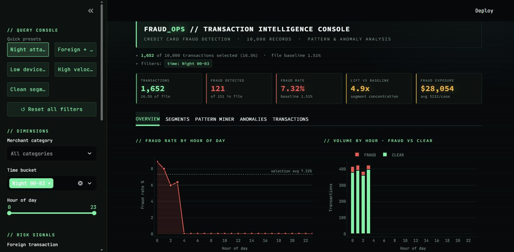

# FRAUD_OPS // Transaction Intelligence Console

An interactive Streamlit dashboard for investigating credit-card fraud across 10,000
transactions. Built for **exploration**, not reporting: filter down to a segment, let
the miner rank which feature combinations actually carry fraud, and drill through to
the underlying rows.

Dark "hacker" console aesthetic — near-black surfaces, neon accents, monospace type.



---

## Why the dashboard is shaped this way

The dataset was profiled before any UI was written, and it turned out that the signal
lives almost entirely in **feature interactions** rather than in any single column:

| Signal | Fraud rate | vs. 1.51% baseline |
|---|---|---|
| Baseline (151 / 10,000) | 1.51% | — |
| `velocity_last_24h >= 5` | 10.42% | 6.9x |
| `location_mismatch = 1` | 8.40% | 5.6x |
| `foreign_transaction = 1` | 8.38% | 5.6x |
| `transaction_hour` 00–03 | 7.32% | 4.9x |
| `device_trust_score <= 40` | 5.91% | 3.9x |
| **night + low trust + foreign** | **100.0% (41/41)** | **66x** |
| **night + foreign + mismatch** | **100.0% (13/13)** | **66x** |
| day + domestic + location OK | **0.00% (0 / 6,900)** | — |

Two consequences drove the design:

1. **69% of the file is a provably clean segment** (0 fraud in 6,900 rows), so the
   interesting data is a small, dense minority. The UI has to make that minority easy
   to isolate.
2. **No single column gets near the combinations.** A dashboard of per-column bar
   charts would hide the best findings, so the centrepiece is an automated miner that
   scans combinations and ranks them — rather than asking the analyst to guess.

---

## The five tabs

### 1 · Overview
Headline KPIs, fraud rate by hour, volume split fraud/clear, the risk-flag ladder, and
a ranked single-feature driver table.

The risk-flag ladder is the clearest single view of the data — fraud rate by how many
of the five known risk conditions a transaction trips:

| Flags tripped | 0 | 1 | 2 | 3 | 4 |
|---|---|---|---|---|---|
| Fraud rate | 0.0% | 0.0% | 0.6% | **97.2%** | **100.0%** |



### 2 · Pattern Miner — the core
Scans every combination of the selected dimensions up to depth 3 and ranks them by how
much they concentrate fraud. On the full file it evaluates **1,444 patterns**.

Ranking uses a **Wilson score lower bound** rather than raw rate, so a 2-of-2 fluke
cannot outrank a well-evidenced segment. That matters here: with only 151 fraud rows,
deep slices hit tiny samples fast. Every row carries its own support count.



### 3 · Segments
Breakdown bars for any dimension, fraud-vs-clear distributions for any numeric column,
a two-dimension fraud-rate matrix, and a free scatter explorer.



Cells in the matrix below the support threshold are **left blank** rather than
coloured — a 1-of-2 cell would otherwise render as the hottest thing on screen.



### 4 · Anomalies
Robust z-scores (median / MAD, not mean / stdev, so a few extreme values cannot inflate
the spread and hide the outliers they belong to). Scores are computed **within the
current selection**, so filtering to a segment re-bases the scan onto that segment's
own normal rather than the whole file.



### 5 · Transactions
Drill-down table with a column chooser, sorting, and CSV export of the current selection.

---

## Filtering

The sidebar drives everything. Alongside per-dimension controls (merchant, time bucket,
hour, amount, device trust, velocity, age, foreign, location mismatch, fraud status,
minimum risk flags) there are **quick presets** that jump straight to a known segment:

*Night attacks · Foreign + mismatch · Low device trust · High velocity · Clean segment*

Applying **Night attacks** narrows to 1,652 transactions at a 7.32% fraud rate — 4.9x
the file baseline — and every chart, the miner, and the anomaly scan re-base onto it:



Active filters are always listed under the header, so what is on screen is never
ambiguous, and **Reset all filters** returns to the full file.

---

## Colour: measured, not chosen

The hacker aesthetic governs the chrome. It deliberately does **not** drive the data
encoding, because the encoding was validated rather than eyeballed. Candidate palettes
were run through the six computable checks (OKLCH lightness band, chroma floor,
CVD separation under Machado-Oliveira-Fernandes simulation, normal-vision floor, and
WCAG contrast) against this dashboard's actual surface `#0b1210`:

| Candidate | Result |
|---|---|
| 5 categorical hues for the merchant categories (all-pairs) | **FAIL** — worst pair CVD ΔE **1.6**, normal-vision ΔE 10.6 |
| First 3 categorical hues (all-pairs) | PASS — CVD ΔE 9.4, normal 20.9 |
| Binary `#2bf5a0` ↔ `#ff4d4d` | **PASS** — CVD ΔE 17.5, normal 41.6, contrast 13.2:1 / 5.8:1 |

So the rules the charts follow:

- **Colour encodes fraud status only** — neon green = CLEAR, red = FRAUD — always
  paired with a text label, never colour alone.
- **Merchant category is never a colour.** Category breakdowns are single-hue bars
  sorted by value, with identity carried by the axis label.
- **Magnitude** uses a one-hue green ramp (`#0d3b2a → #5cf3ad`, monotone lightness,
  min adjacent ΔL 0.089). Heatmap cell values switch to dark ink on the bright end of
  the ramp so they stay legible at both extremes.
- **No dual-axis charts.** Rate and volume are separate panels.

---

## Running it

```bash
pip install -r requirements.txt
streamlit run app.py
```

Then open http://localhost:8501. The dataset ships in `data/` so it runs straight
after clone.

## Layout

```
app.py                     entry point: page config, theme, tab router
src/theme.py               design tokens, CSS, shared plotly layout
src/data.py                cached load + derived features (bands, risk flags)
src/filters.py             sidebar controls, presets, filter state
src/patterns.py            lift miner, Wilson bound, robust anomaly scoring
src/charts.py              plotly figure builders
data/                      the 10k-row source CSV
docs/screenshots/          the images above
```

**Stack:** Python 3.14 · Streamlit 1.63 · Plotly 7.0 · pandas 3.0 · numpy 2.5

## Data

`credit_card_fraud_10k.csv` — 10,000 rows, 10 columns, no nulls, no duplicate IDs.
Synthetic data: no real cardholder identifiers.

`transaction_id · amount · transaction_hour · merchant_category ·
foreign_transaction · location_mismatch · device_trust_score ·
velocity_last_24h · cardholder_age · is_fraud`
